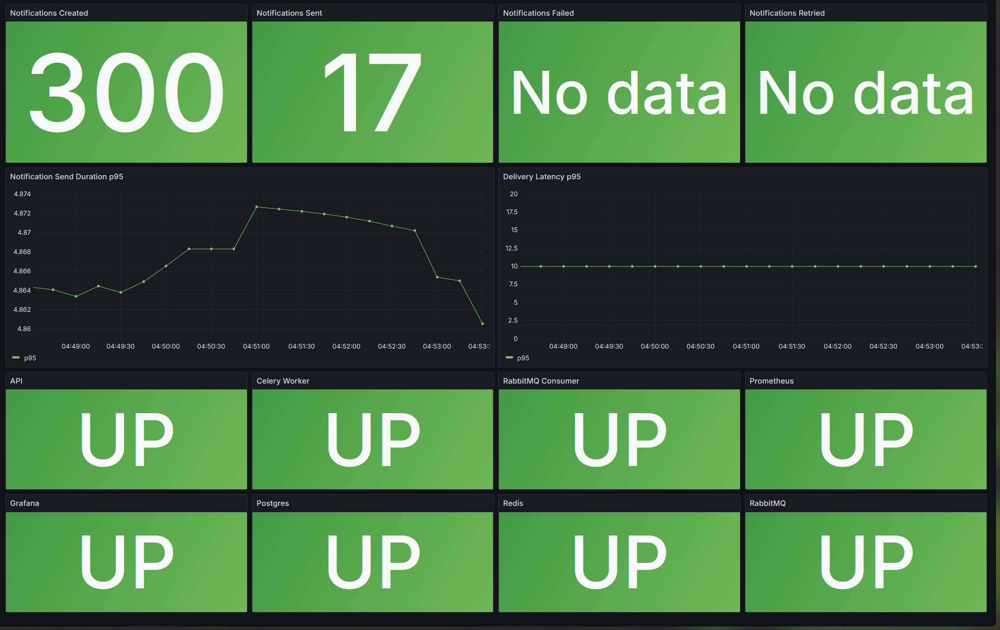

# Notification Service

Сервис для приема, хранения и асинхронной отправки уведомлений.  
Сейчас в проекте реализован канал `email` через `SMTP`, файловые шаблоны писем, `RabbitMQ` consumer, `Celery` worker и API для создания, повторной отправки и просмотра уведомлений.

## Возможности

- HTTP API для создания, повторной отправки и получения уведомлений
- асинхронная отправка через `Celery`
- прием сообщений из `RabbitMQ`
- провайдер `email/smtp`
- файловые шаблоны писем с рендерингом через `Jinja2`
- `idempotency` при создании уведомлений
- хранение статуса отправки, числа попыток и `failure_reason`
- мониторинг через `Prometheus`
- готовые `Grafana` dashboards по сервису, воркеру и провайдеру
- unit-first тесты и узкий SQLite smoke-слой

## Архитектура


Основной поток работы:

1. Клиент отправляет запрос в API или сообщение приходит через `RabbitMQ` (или другой брокер).
2. Сервис валидирует входные данные и сохраняет `Notification` в базу.
3. После создания записи ставится задача в `Celery`.
4. `Celery` worker загружает уведомление из БД.
5. `TemplateManager` рендерит шаблон письма по `template_code` и `payload`.
6. `SMTPProvider` отправляет письмо и возвращает результат.
7. Статус уведомления в БД обновляется на `SENT` или `FAILED`.

Подробное описание архитектуры можно позже вынести в [`docs/architecture.md`](docs/architecture.md).

## Мониторинг

В проекте реализован monitoring stack на базе `Prometheus` и `Grafana`.

Что уже есть:

- endpoint `GET /metrics` у API
- метрики по API, доставке уведомлений, SMTP provider и `Celery`
- health-monitoring сервисов через `Prometheus` и `blackbox-exporter`
- готовые dashboards:
  - `Notification Service Overview`
  - `Notification Service Provider`
  - `Notification Service Celery`



## Структура проекта

- `app/api` - HTTP API и схемы запросов/ответов
- `app/services` - прикладная логика работы с уведомлениями
- `app/providers` - провайдеры доставки и рендер шаблонов
- `app/celery_app` - Celery application и фоновые задачи
- `app/brokers` - consumer для `RabbitMQ`
- `app/models` - SQLAlchemy модели
- `app/templates` - шаблоны уведомлений
- `alembic` - миграции БД
- `test` - unit-тесты и узкие integration smoke-тесты
- `docs` - дополнительная документация и изображения
- `infra` - Dockerfile'ы и вспомогательная контейнерная инфраструктура

## Конфигурация

Основная конфигурация хранится в `.env`.  
Для старта локальной среды используй шаблон [`.env.example`](.env.example).

Основные группы переменных:

- `APP_*` - базовые настройки приложения
- `DB_*` - база данных
- `CELERY_*` - брокер и backend для `Celery`
- `RMQ_*` - `RabbitMQ`
- `SMTP_*` - SMTP-провайдер
- `METRICS_*` - endpoints и порты для Prometheus metrics
- `GRAFANA_*` - учетные данные Grafana

Несколько важных замечаний:

- для `docker-compose` по умолчанию используется `DB_TYPE=postgres`
- `RMQ_VHOST` можно задавать как `/` или как обычное имя, например `notifications`
- для реальной отправки email нужно заполнить `SMTP_*` корректными значениями

Подробности по конфигурации можно вынести в [`docs/configuration.md`](docs/configuration.md).

## Локальный запуск

### Предварительные требования

- `Docker` и `Docker Compose`
- Python `3.13` для локального запуска без контейнеров

### Подготовка окружения

1. Создай локальный `.env` на основе шаблона:

```bash
cp .env.example .env
```

2. Заполни SMTP-настройки, если планируешь проверять реальную отправку писем.

### Запуск через Docker Compose

```bash
docker compose -f docker-compose.yml up --build
```

После старта будут подняты:

- `api`
- `postgres`
- `redis`
- `rabbitmq`
- `celery-worker`
- `rabbitmq-consumer`
- `migrate`
- `prometheus`
- `grafana`
- `blackbox-exporter`

API будет доступно на `http://localhost:8000`.

Интерфейсы мониторинга:

- `Prometheus` - `http://localhost:9090`
- `Grafana` - `http://localhost:3000`

### Применение миграций

В `docker-compose.yml` миграции применяются отдельным сервисом `migrate` автоматически при старте.

### Запуск тестов

```powershell
$env:PYTHONPATH='app'; .\.venv\Scripts\python -m pytest test
```

## Пример использования

Пример запроса на создание email-уведомления:

```json
{
  "user_id": 10,
  "channel": "email",
  "recipient": "user@example.com",
  "template_code": "welcome",
  "payload": {
    "name": "Alex"
  },
  "idempotency_key": "welcome-email-1"
}
```

Пример `POST` запроса:

```bash
curl -X POST http://localhost:8000/api/v1/notifications ^
  -H "Content-Type: application/json" ^
  -d "{\"user_id\":10,\"channel\":\"email\",\"recipient\":\"user@example.com\",\"template_code\":\"welcome\",\"payload\":{\"name\":\"Alex\"},\"idempotency_key\":\"welcome-email-1\"}"
```

После создания:

- уведомление сохраняется в БД
- ставится задача в `Celery`
- worker пытается отправить письмо
- статус можно проверить через `GET /api/v1/notifications/{id}`

## Шаблоны

Шаблоны писем лежат в директории:

```text
app/templates/email/<template_code>/
```

Для email сейчас поддерживаются файлы:

- `subject.txt`
- `body.html`
- `body.txt`

Пример:

```text
app/templates/email/welcome/
```

Подробности по шаблонам и контракту `payload` можно вынести в [`docs/templates.md`](docs/templates.md).

## Провайдеры

Сейчас в проекте реализован один провайдер:

- `SMTPProvider` для канала `email`

Провайдеры регистрируются через `ProviderRegistry`, который:

- хранит провайдер по каналу
- выдает runtime `provider_id`
- позволяет получать провайдер по `channel` и по `id`

Если позже появятся новые каналы, логично добавлять их в `app/providers` с тем же контрактом `NotificationProvider`.

Подробности можно вынести в [`docs/providers.md`](docs/providers.md).

## Тестирование

В проекте используется подход `unit-first`.

Покрыты:

- `TemplateManager`
- `ProviderRegistry`
- `SMTPProvider`
- `NotificationService`
- `Celery` task отправки
- API маршруты

Дополнительно есть узкий smoke-test на `SQLite` для проверки основных DB-стыков.

Основная команда запуска:

```powershell
$env:PYTHONPATH='app'; python -m pytest test
```

Подробности по тестовому подходу можно вынести в [`docs/testing.md`](docs/testing.md).

## API

Базовый префикс API:

```text
/api/v1
```

Основные endpoints:

- `POST /notifications`
- `POST /notifications/{notification_id}/retry`
- `GET /notifications/{notification_id}`

После запуска приложения документация OpenAPI доступна по адресам:

- `http://localhost:8000/docs`
- `http://localhost:8000/redoc`

Если потребуется более подробное описание, его можно вынести в [`docs/api.md`](docs/api.md).

## Текущие ограничения

- сейчас реализован только канал `email`
- провайдер доставки только один - `SMTP`
- `scheduled_at` пока не реализован как полноценный планировщик
- управление шаблонами выполняется только через файловую структуру проекта
- secrets management пока остается на уровне `.env`
- metrics для инфраструктуры строятся через probe-слой, а не через полноценные native exporters для каждого сервиса

## Дополнительная документация

- [Конфигурация](docs/configuration.md)
- [Архитектура](docs/architecture.md)
- [Шаблоны](docs/templates.md)
- [Провайдеры](docs/providers.md)
- [Тестирование](docs/testing.md)
- [API](docs/api.md)
