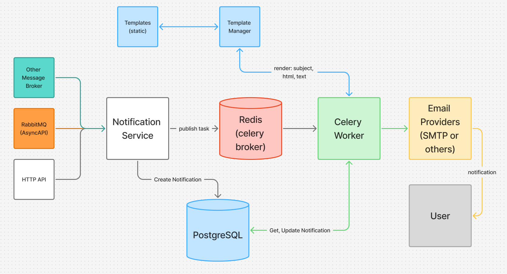

# Архитектура

## Общая схема

Сервис построен вокруг модели "принять запрос -> сохранить уведомление -> отправить асинхронно".

Основной поток:

1. Клиент отправляет HTTP-запрос в API или публикует сообщение в `RabbitMQ`.
2. `NotificationService` валидирует данные на уровне схем и создает запись `Notification` в БД.
3. После создания уведомления ставится задача в `Celery`.
4. `Celery` worker читает уведомление из БД и выбирает провайдер по `channel`.
5. `TemplateManager` рендерит шаблон по `template_code` и `payload`.
6. Провайдер доставки отправляет уведомление и возвращает результат.
7. Сервис обновляет `status`, `attempts`, `provider_id`, `failure_reason`, `sent_at`.

## Основные компоненты

### API

Находится в `app/api`.

Отвечает за:

- прием запросов
- валидацию входных схем
- вызов прикладного сервиса
- отображение доменных ошибок в HTTP-ответы

### NotificationService

Находится в `app/services/notification.py`.

Отвечает за:

- создание уведомлений
- `idempotency` по `idempotency_key`
- повторную отправку (`retry`)
- базовые переходы статусов

### Celery worker

Находится в `app/celery_app`.

Отвечает за:

- асинхронную отправку уведомлений
- обновление состояния доставки
- запись `failure_reason` при ошибках

### RabbitMQ consumer

Находится в `app/brokers`.

Отвечает за:

- прием сообщений из очереди
- преобразование message payload в `CreateNotificationRequest`
- передачу управления в `NotificationService`

### Providers

Находятся в `app/providers`.

Сейчас реализован:

- `SMTPProvider` для канала `email`

Выбор провайдера выполняется через `ProviderRegistry`.

### TemplateManager

Находится в `app/providers/templates_manager.py`.

Отвечает за:

- загрузку шаблонов с файловой системы
- рендер `subject.txt`, `body.html`, `body.txt`
- выброс `TemplateRenderingError`, если шаблон отсутствует или не может быть отрендерен

## Слой данных

Основная таблица:

- `notifications`

Сейчас в модели хранятся:

- `channel`
- `recipient`
- `template_code`
- `payload`
- `status`
- `attempts`
- `max_attempts`
- `idempotency_key`
- `provider_id`
- `failure_reason`
- `scheduled_at`
- `sent_at`

## Статусы уведомления

Поддерживаются статусы:

- `PENDING` - уведомление создано и ожидает отправки
- `PROCESSING` - worker начал обработку
- `SENT` - отправка успешна
- `FAILED` - отправка завершилась ошибкой

## Текущие ограничения архитектуры

- сейчас поддерживается только `email`
- `scheduled_at` пока не является полноценным scheduler-механизмом
- provider result сохраняется частично, без отдельной структуры provider metadata в БД
- нет отдельного orchestration-слоя для нескольких provider implementations одного канала

## Связанные документы

- [README](../README.md)
- [Провайдеры](providers.md)
- [Шаблоны](templates.md)
- [API](api.md)
